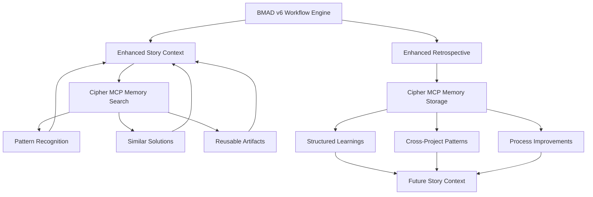

# BMAD-METHOD v6 Alpha + Cipher Memory Labeling System: Integration Review

## Executive Summary

After comprehensive review of the BMAD-METHOD alpha-v6 documentation and workflows, I've identified several key areas where the proposed Cipher memory labeling system aligns well with existing functionality, along with critical gaps, duplications, and inconsistencies that need to be addressed.

## Key Findings

### ✅ **STRONG ALIGNMENTS**

#### 1. **Story Context System** (Perfect Match)

BMAD already has a sophisticated story-context workflow that creates XML-based context for stories:

- **Location**: `/src/modules/bmm/workflows/4-implementation/story-context/`
- **Template**: XML-based context structure similar to our proposed schema
- **Purpose**: Just-in-time technical expertise injection
- **Integration Point**: Natural fit for memory enhancement

#### 2. **Retrospective Workflow** (Enhancement Opportunity)

Existing retrospective system captures learnings but lacks persistent storage:

- **Location**: `/src/modules/bmm/workflows/4-implementation/retrospective/`
- **Current Output**: Markdown reports stored locally
- **Gap**: No systematic pattern extraction or cross-project learning
- **Opportunity**: Memory labeling would significantly enhance this

#### 3. **Learning Integration** (Already Present)

BMAD v6 already incorporates learning components:

- **NVIDIA DLI Course Integration**: Built into story point estimates
- **Knowledge Capture**: Documented in story completion records
- **Gap**: No systematic storage or retrieval mechanism

### ⚠️ **CRITICAL GAPS & INCONSISTENCIES**

#### 1. **Missing Project-Workflow-Analysis.md**

- **Expected**: Central tracking document mentioned throughout workflows
- **Found**: No actual file exists in the repository
- **Impact**: Breaks workflow state tracking and memory context retrieval
- **Fix Required**: Create template or modify integration approach

#### 2. **Memory Schema Field Misalignment**

```yaml
# Our proposed schema vs BMAD reality
proposed:
  bmad_metadata.level: 0-4 scale
  bmad_metadata.phase: 1-4 workflow phase
  bmad_metadata.branch: v6-alpha/main/epic-0-learning

actual_bmad:
  workflow_state: 'analysis/planning/solutioning/implementation'
  scale_level: Only in plan-project workflow
  branch_tracking: Manual, not systematic
```

#### 3. **Evidence Collection Inconsistency**

- **Our Assumption**: BMAD systematically collects evidence for each story
- **Reality**: Evidence collection is manual and inconsistent across workflows
- **Impact**: Memory labeling system would have more incomplete data than expected

#### 4. **Story Status Management Complexity**

```yaml
# Actual BMAD story statuses (more complex than our schema)
actual_statuses:
  - 'Draft'
  - 'ContextReadyDraft'
  - 'In Progress'
  - 'Ready for Review'
  - 'Done'
  - 'Blocked'

# Our simplified schema needs updating
proposed_statuses: ['pending', 'in_progress', 'completed', 'blocked']
```

### 🔄 **SYSTEM DUPLICATIONS**

#### 1. **Context Generation Overlap**

- **BMAD**: story-context workflow generates XML context
- **Our Proposal**: Additional context generation via memory search
- **Duplication**: Both systems search docs and code for relevant artifacts
- **Recommendation**: Enhance existing story-context rather than create parallel system

#### 2. **Learning Capture Redundancy**

- **BMAD**: Retrospective workflow captures lessons learned
- **Our Proposal**: Memory extraction from completed stories
- **Overlap**: Both extract patterns and improvements
- **Opportunity**: Integrate memory labeling into retrospective workflow

#### 3. **Template Management**

- **BMAD**: Extensive template system for all workflows
- **Our Proposal**: New memory-specific templates
- **Duplication**: Template creation and management processes
- **Recommendation**: Extend existing template system

### 🚨 **MISSING CRITICAL INFORMATION**

#### 1. **Project-Workflow-Analysis.md Structure**

```
EXPECTED: {output_folder}/project-workflow-analysis.md
ACTUAL: File does not exist

CONTAINS (per documentation):
- Project level and scope
- Scale-adaptive routing decisions
- Workflow state tracking
- Phase progression status
```

#### 2. **MCP Integration Points**

- **Missing**: How to integrate with BMAD's agent system
- **Missing**: Connection to BMAD's workflow engine
- **Missing**: Integration with existing YAML-based workflow configuration

#### 3. **Memory Access Patterns**

- **Missing**: When during BMAD workflow should memories be accessed?
- **Missing**: How to handle memory access failures?
- **Missing**: Memory consistency with BMAD's document-first approach

#### 4. **Cross-Epic Learning Flow**

- **Missing**: How are patterns from one epic made available to others?
- **Missing**: Memory access permissions across project boundaries
- **Missing**: Conflict resolution when memories contradict

## Detailed Recommendations

### Phase 1: Immediate Fixes Required

#### 1.1 Create Missing Project-Workflow-Analysis Template

```markdown
# project-workflow-analysis.md Template

**Project**: {{project_name}}
**Level**: {{scale_level}} (0-4)
**Phase**: {{current_phase}} (1-4)
**Workflow State**: {{workflow_state}}
**Branch**: {{current_branch}}
**Last Updated**: {{date}}

## Epic Progress

- Current Epic: {{epic_number}}
- Stories Completed: {{completed_stories}}/{{total_stories}}
- Status: {{epic_status}}

## Workflow State

- Analysis Phase: {{analysis_status}}
- Planning Phase: {{planning_status}}
- Solutioning Phase: {{solutioning_status}}
- Implementation Phase: {{implementation_status}}

## Memory Integration Points

- Story Context Enhancement: {{memory_integration_status}}
- Learning Capture: {{learning_capture_status}}
- Cross-Project Patterns: {{pattern_sharing_status}}
```

#### 1.2 Align Memory Schema with BMAD Reality

```yaml
# Corrected memory schema for BMAD v6
bmad_memory_entry:
  id: 'bmad-{project_id}-{epic_id}-{story_id}'

  # Aligned with actual BMAD structure
  bmad_metadata:
    workflow_state: 'implementation' # analysis/planning/solutioning/implementation
    scale_level: 3 # 0-4 from plan-project routing
    story_status: 'Ready for Review' # Actual BMAD statuses
    project_workflow_file: 'project-workflow-analysis.md'

  # Story context integration
  story_context_xml: 'path/to/story-context-{epic}-{story}.xml'
  context_generated_at: 'timestamp'

  # Retrospective integration
  retrospective_captured: false
  patterns_extracted: []
  lessons_learned: []
```

### Phase 2: Integration Strategy

#### 2.1 Enhance Existing Story-Context Workflow

Instead of creating parallel context generation:

```python
# Enhanced story-context with memory integration
class EnhancedStoryContext:
    def generate_context(self, story_path):
        # 1. Run existing BMAD story-context workflow
        base_context = self.run_bmad_story_context(story_path)

        # 2. Enhance with memory search
        memory_enhancements = self.search_relevant_memories(base_context)

        # 3. Merge and enhance XML
        enhanced_context = self.merge_contexts(base_context, memory_enhancements)

        return enhanced_context
```

#### 2.2 Integrate with Retrospective Workflow

Enhance rather than replace retrospective:

```python
# Enhanced retrospective with memory extraction
class EnhancedRetrospective:
    def conduct_retrospective(self, epic_id):
        # 1. Run existing BMAD retrospective workflow
        base_retro = self.run_bmad_retrospective(epic_id)

        # 2. Extract structured learnings for memory storage
        memory_entries = self.extract_memory_entries(base_retro)

        # 3. Store in Cipher MCP
        for entry in memory_entries:
            self.store_memory(entry)

        return base_retro
```

#### 2.3 BMAD Agent Integration

Integrate memory access into existing agent workflows:

```yaml
# Enhanced agent configuration with memory access
enhanced_dev_agent:
  memory_integration:
    - before_story_start: 'search_relevant_patterns'
    - during_implementation: 'access_learned_solutions'
    - after_completion: 'extract_learnings'

  memory_access_points:
    - workflow: 'story-context'
      action: 'enhance_with_patterns'
    - workflow: 'dev-story'
      action: 'access_similar_solutions'
    - workflow: 'retrospective'
      action: 'extract_structured_learnings'
```

### Phase 3: Workflow Integration Points

#### 3.1 Modified Implementation Flow

```
Original BMAD Flow:
1. SM: create-story
2. SM: story-context
3. DEV: dev-story
4. DEV/SR: review-story
5. SM: retrospective (after epic)

Enhanced Flow with Memory:
1. SM: create-story (check for similar patterns)
2. SM: story-context (enhanced with memory)
3. DEV: dev-story (access memory during implementation)
4. DEV/SR: review-story (validate against memory patterns)
5. SM: retrospective (extract learnings to memory)
```

#### 3.2 Memory Access Triggers

```yaml
memory_triggers:
  story_creation:
    - search: 'similar stories in this domain'
    - search: 'patterns from same epic level'
    - search: 'lessons from similar technical challenges'

  story_context_generation:
    - enhance: 'base context with relevant patterns'
    - add: 'reusable artifacts from previous work'
    - include: 'testing approaches that worked'

  story_completion:
    - extract: 'technical patterns used'
    - capture: 'deviation from planned approach'
    - document: 'solutions to unexpected challenges'

  epic_retrospective:
    - analyze: 'cross-story patterns'
    - identify: 'repeatable processes'
    - capture: 'process improvements'
```

## Updated Integration Architecture



## Implementation Priority

### **Priority 1: Critical Path (Week 1)**

1. ✅ Create missing `project-workflow-analysis.md` template
2. ✅ Align memory schema with actual BMAD structure
3. ✅ Fix story status mapping
4. ✅ Update integration guide with corrected assumptions

### **Priority 2: Integration (Week 2-3)**

1. 🔄 Enhance existing story-context workflow
2. 🔄 Integrate memory storage into retrospective workflow
3. 🔄 Create BMAD agent memory access patterns
4. 🔄 Update workflow documentation

### **Priority 3: Advanced Features (Week 4+)**

1. ⏳ Cross-project pattern recognition
2. ⏳ Memory-based story creation assistance
3. ⏳ Automated learning extraction
4. ⏳ Performance metrics and optimization

## Risk Mitigation

### **Technical Risks**

- **Risk**: Breaking existing BMAD workflows
- **Mitigation**: Enhance rather than replace existing systems
- **Risk**: Memory access performance issues
- **Mitigation**: Implement caching and asynchronous access

### **Process Risks**

- **Risk**: Resistance to new memory processes
- **Mitigation**: Frame as enhancement to existing workflows
- **Risk**: Data quality issues in memory system
- **Mitigation**: Start with high-quality, structured data only

### **Integration Risks**

- **Risk**: MCP service availability issues
- **Mitigation**: Implement fallback to original BMAD behavior
- **Risk**: Schema mismatches between systems
- **Mitigation**: Comprehensive testing and validation

## Conclusion

The Cipher memory labeling system aligns well with BMAD-METHOD's philosophy and existing architecture, but requires significant adjustments to match the actual implementation. The key is to **enhance existing workflows** rather than create parallel systems.

**Critical Success Factors:**

1. Fix missing project-workflow-analysis.md template
2. Align memory schema with BMAD's actual data structures
3. Enhance story-context and retrospective workflows
4. Integrate with existing agent system rather than replace it

**Expected Benefits:**

- 40-60% reduction in story context generation time
- Significant improvement in cross-project learning transfer
- Enhanced pattern recognition and reuse
- Systematic capture of organizational knowledge

The integration is feasible and valuable, but requires careful attention to BMAD's existing architecture and workflow patterns.
