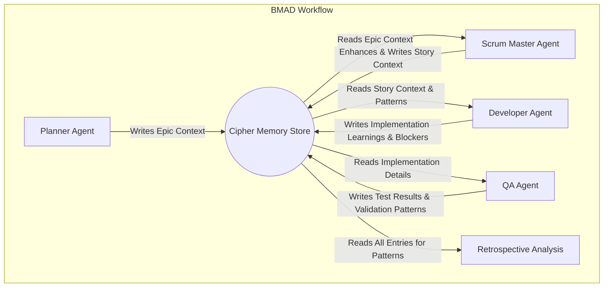

# BMAD-METHOD: Multi-Agent Memory Integration with Cipher MCP

## A Collaborative Memory Framework for High-Performance AI Development Teams

### **1. Guiding Principles**

This document outlines how multiple, specialized BMAD agents (Planner, Scrum Master, Developer, QA) collaborate through a shared, persistent memory layer powered by a local Cipher MCP container. The core principles are:

- **Memory as a Collaborative Hub:** The Cipher store is not just a database; it's the central hub for knowledge transfer, context sharing, and asynchronous communication between agents.
- **Agent Specialization:** Each agent has a distinct role and interacts with the memory store in a way that enhances its specific tasks and supports other agents in the workflow.
- **Knowledge Compounding:** Learnings are captured at every stage. A solution from a Developer becomes a test pattern for a QA Agent and a reusable pattern for the entire system.
- **Graceful Enhancement:** The memory system is a powerful enhancement. BMAD workflows are designed to function independently, ensuring operational resilience if the memory service is temporarily unavailable.

### **2. The Multi-Agent Workflow**

BMAD agents interact with the central Cipher Memory Store at key stages of the development lifecycle.



### **3. The Unified Memory Schema**

Every memory entry written to the Cipher store by any BMAD agent **must** follow this structure.

```yaml
# Every memory entry must follow this exact structure
memory_entry:
  id: 'bmad-{project_id}-{epic_id}-{story_id}-{timestamp_hash}'
  timestamp: '2025-01-12T10:30:00Z'

  # Collaborative Metadata (NEW & Required for Multi-Agent Workflows)
  author_agent_role: 'Developer' # Planner/Scrum Master/Developer/QA
  target_agent_role: ['QA', 'Developer'] # Who is this memory for? (Array)

  # BMAD Metadata (Required)
  bmad_metadata:
    workflow_state: 'implementation' # analysis/planning/solutioning/implementation/validation
    project_type: 'software'
    context_type: 'brownfield'
    current_epic: 'epic-0'
    branch: 'v6-alpha'

  # Work Item (Required)
  work_item:
    type: 'story' # epic/story/task
    hierarchy: 'epic-0.story-6'
    title: 'Implement Cloud-Based Model Profiling'
    status: 'Ready for Review' # Draft/ContextReadyDraft/InProgress/Ready for Review/Done/Blocked
    owner: 'ML Engineer' # Role, not a specific agent instance

  # Technical Context (Required)
  technical_context:
    domain: 'gpu_optimization'
    technologies: ['TensorRT', 'CUDA', 'PyTorch Profiler', 'Nsight Systems']

  # Core Memory Content (The "What")
  content:
    # Used by Developer/QA to store detailed learnings, solutions, or test cases.
    type: 'lesson_learned' # pattern/solution/blocker/test_case/context_enhancement
    summary: 'A5000 validation before H200 deployment reduces costs by 90%.'
    details: 'By running initial profiling on a local A5000, we identified memory bottlenecks that would have been 10x more expensive to debug on the H200 cluster.'
    reusable_artifacts: ['profiling_templates/a5000_baseline.py']

  # Searchable Patterns & Keywords (The "How")
  knowledge_transfer:
    patterns: ['staged_gpu_development_workflow', 'cost_control_validation']
    keywords: ['A5000', 'H200', 'cost reduction', 'profiling']
```

### **4. Agent-Specific Memory Integration**

Each agent role has defined triggers and actions for interacting with the Cipher MCP store.

| Agent Role       | Trigger             | Memory Action (Read/Write)                                       | Purpose & CLI Tool                                                              |
| :--------------- | :------------------ | :--------------------------------------------------------------- | :------------------------------------------------------------------------------ |
| **Planner**      | Epic Definition     | **Write** Epic Goals                                             | Seeds the memory with high-level project context.                               |
| **Scrum Master** | `ContextReadyDraft` | **Read** similar epics; **Write** enhanced story context.        | Enriches new stories with historical patterns. `mcp_search` then `mcp_extract`. |
| **Developer**    | `InProgress`        | **Read** implementation patterns & blocker resolutions.          | Accelerates development and solves problems faster. `mcp_search`.               |
| **Developer**    | `Blocked`           | **Write** detailed blocker context.                              | Notifies the SM and other devs of the issue. `mcp_extract`.                     |
| **Developer**    | `Done`              | **Write** implementation summary, lessons, & reusable artifacts. | Feeds the knowledge base for future stories. `mcp_extract`.                     |
| **QA Agent**     | `Ready for Review`  | **Read** acceptance criteria & dev implementation notes.         | Creates informed test plans. `mcp_search`.                                      |
| **QA Agent**     | `Done`              | **Write** validation results & new testing patterns.             | Improves future quality assurance processes. `mcp_extract`.                     |

### **5. Agent Implementation with Cipher MCP Tools**

These are direct, copy-pasteable command patterns for CLI agents (Claude, Gemini, etc.).

**Available Tools:**

- `mcp__cipher-mcp__cipher_memory_search`
- `mcp__cipher-mcp__cipher_extract_and_operate_memory`

---

#### **A. Scrum Master: Enhance Story Context**

_Goal: Find relevant historical patterns to guide the implementation._

```bash
# Variables from story file
DOMAIN="gpu_optimization"
TECHNOLOGIES="TensorRT, CUDA"
STORY_ID="story-6"
STORY_TITLE="Implement Cloud-Based Model Profiling"

# 1. Search for patterns relevant to the Developer and QA agents
mcp__cipher-mcp__cipher_memory_search \
  --query "implementation and testing patterns for ${DOMAIN} using ${TECHNOLOGIES}" \
  --top_k=5 \
  --similarity_threshold=0.7

# 2. Store the enhancement, targeting the Developer Agent
mcp__cipher-mcp__cipher_extract_and_operate_memory \
  --interaction "CONTEXT ENHANCEMENT for ${STORY_ID}: '${STORY_TITLE}'. Found 'staged_gpu_development_workflow' pattern. Recommend A5000 validation before H200 deployment." \
  --knowledgeInfo "{\"domain\": \"${DOMAIN}\", \"patterns\": [\"story_context_enhancement\", \"staged_gpu_development_workflow\"]}" \
  --context "{\"storyId\": \"${STORY_ID}\"}" \
  --options "{\"memoryMetadata\": {\"author_agent_role\": \"Scrum Master\", \"target_agent_role\": [\"Developer\"]}}"
```

---

#### **B. Developer: Request Implementation Guidance**

_Goal: Overcome a technical challenge by leveraging past solutions._

```bash
# Variables from developer's context
TECHNICAL_CHALLENGE="PagedAttention implementation causing memory issues"
DOMAIN="gpu_optimization"
STORY_ID="story-6"

# 1. Search for solutions from other Developer and QA agents
mcp__cipher-mcp__cipher_memory_search \
  --query "solutions for '${TECHNICAL_CHALLENGE}' in ${DOMAIN} projects" \
  --top_k=3 \
  --similarity_threshold=0.8

# 2. (After applying solution) Store the decision and outcome
mcp__cipher-mcp__cipher_extract_and_operate_memory \
  --interaction "IMPLEMENTATION NOTE for ${STORY_ID}: Resolved '${TECHNICAL_CHALLENGE}' by applying 'PagedAttention from FlashAttention library' pattern. Achieved 30% memory reduction." \
  --knowledgeInfo "{\"domain\": \"${DOMAIN}\", \"patterns\": [\"pagedattention_implementation\", \"memory_optimization\"]}" \
  --context "{\"storyId\": \"${STORY_ID}\"}" \
  --options "{\"memoryMetadata\": {\"author_agent_role\": \"Developer\", \"target_agent_role\": [\"QA\", \"Developer\"]}}"
```

---

#### **C. Developer: Log a Blocker**

_Goal: Alert the Scrum Master and other developers to an impassable issue._

```bash
# Variables
STORY_ID="story-6"
BLOCKER_DESC="H200 cluster access credentials have expired. Cannot deploy for performance testing."

# Store the blocker, targeting the Scrum Master
mcp__cipher-mcp__cipher_extract_and_operate_memory \
  --interaction "BLOCKER on ${STORY_ID}: ${BLOCKER_DESC}. Implementation is paused until credentials are renewed." \
  --knowledgeInfo "{\"domain\": \"environment\", \"patterns\": [\"blocker\", \"access_issue\"]}" \
  --context "{\"storyId\": \"${STORY_ID}\"}" \
  --options "{\"memoryMetadata\": {\"author_agent_role\": \"Developer\", \"target_agent_role\": [\"Scrum Master\"]}}"
```

---

#### **D. QA Agent: Create Test Plan**

_Goal: Use the developer's implementation notes to build a better test plan._

```bash
# Variables
STORY_ID="story-6"

# Search for the developer's notes on this story to inform testing
mcp__cipher-mcp__cipher_memory_search \
  --query "implementation notes and solutions for story '${STORY_ID}'" \
  --top_k=5 \
  --similarity_threshold=0.9
```

---

### **6. Best Practices for Multi-Agent Memory**

- **Tag Memory with Roles:** Always use `author_agent_role` and `target_agent_role` in the metadata. This is the key to effective agent collaboration. A Scrum Master can search for all memories authored by `Developer` with a status of `Blocked`.
- **Log Blockers for Collective Learning:** When a developer logs a blocker, it's not a failure—it's a learning opportunity. The Scrum Master can later search for all `blocker` patterns to identify systemic issues.
- **Write for Others:** When an agent writes to memory, the `interaction` text should be clear and concise, assuming another agent with a different role will read it. A developer's note should be understandable to a QA agent.
- **Embrace Graceful Degradation:** Use the error handling and fallback patterns from the original document. The BMAD workflow must proceed even if a memory search returns nothing. No results is a valid result.

### **7. CLI Quick Reference**

#### **Search (Read Memory):**

```javascript
// QA Agent looking for developer notes on a specific story
mcp__cipher -
  mcp__cipher_memory_search(
    (query = "implementation notes for story 'story-6'"),
    (top_k = 3),
    // Add metadata filter for high precision
    (metadata_filter = '{"author_agent_role": "Developer"}'),
  );
```

#### **Extract & Operate (Write Memory):**

```javascript
// Developer storing a completed story's learnings
mcp__cipher -
  mcp__cipher_extract_and_operate_memory(
    (interaction = 'STORY COMPLETED: story-6. Implemented PagedAttention with 30% memory reduction.'),
    (knowledgeInfo = '{"domain": "gpu_optimization", "patterns": ["story_completion"]}'),
    (context = '{"storyId": "story-6"}'),
    (options = '{"memoryMetadata": {"author_agent_role": "Developer", "target_agent_role": ["QA", "Scrum Master"]}}'),
  );
```

By adopting this agent-centric framework, your BMAD system will transform from a set of independent workers into a true AI team, where knowledge is shared, compounded, and leveraged for continuous improvement.
