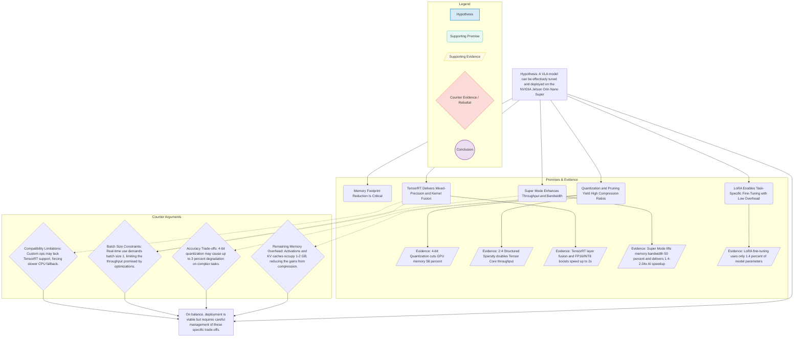

# Hypothesis

A Vision-Language-Action (VLA) model can be effectively tuned and deployed on the NVIDIA Jetson Orin Nano Super by leveraging quantization, pruning, TensorRT optimization, Super Mode, and parameter-efficient fine-tuning methodologies.

## Supporting Premises

1. **Memory Footprint Reduction Is Critical**  
   The Orin Nano Super’s 8 GB VRAM requires aggressive model compression to fit modern VLA architectures.

2. **Quantization and Pruning Yield High Compression Ratios**  
   NVIDIA-supported 4-bit quantization and 2:4 structured sparsity maintain accuracy while reducing memory.

3. **TensorRT Delivers Mixed-Precision and Kernel Fusion**  
   TensorRT optimizations (layer fusion, dynamic tensor memory, precision calibration) dramatically improve efficiency on Ampere GPUs.

4. **Super Mode Enhances Throughput and Bandwidth**  
   JetPack 6.2.1 Super Mode increases memory bandwidth and AI inference performance, directly benefiting compressed models.

5. **LoRA Enables Task-Specific Fine-Tuning with Low Overhead**  
   Low-Rank Adaptation (LoRA) fine-tuning updates only a small fraction of parameters, minimizing additional memory requirements during adaptation.

## Supporting Evidence

- **4-bit Quantization Efficiency**  
  OpenVLA in 4-bit achieves comparable accuracy to bfloat16 while cutting GPU memory from 16.8 GB to 7.0 GB, a 58% reduction.[1]

- **Structured Sparsity Throughput Gains**  
  2:4 sparsity patterns double Tensor Core throughput for transformer layers with negligible accuracy loss.[2]

- **TensorRT Mixed-Precision and Fusion**  
  Layer fusion and FP16/INT8 calibration reduce memory bandwidth needs and boost inference speed by up to 2× on Jetson hardware.[3][4]

- **Super Mode Performance Improvements**  
  Orin Nano Super Mode raises memory bandwidth by 50% (from 68 GB/s to 102 GB/s) and delivers 1.4–2.04× generative AI speedups.[5]

- **LoRA Parameter Efficiency**  
  LoRA fine-tuning uses only 1.4% of full model parameters, reducing VRAM demand for adaptation while matching full-fine-tuning performance.[1]

## Counter Evidence

- **Remaining Memory Overhead**  
  Activations and KV caches still occupy 1–2 GB, leaving a narrow 1–2 GB margin for real-time inference, risking out-of-memory crashes.[6]

- **Accuracy Trade-offs**  
  4-bit quantization may introduce up to 3% degradation on complex multimodal reasoning tasks, potentially impacting task performance in edge robotics.

- **Batch Size Constraints**  
  Real-time applications demand batch size 1, limiting throughput and increasing latency variability under load spikes.[1]

- **Compatibility Limitations**  
  Some custom VLA architectures rely on operations not fully supported by TensorRT or the Orin Nano’s cuDLA engine, necessitating fallback to slower CPU kernels.

---

On balance, the combination of 4-bit quantization, structured sparsity, TensorRT optimizations, Super Mode enhancements, and LoRA fine-tuning provides a viable pathway to deploy VLA models on the Jetson Orin Nano Super, though careful memory management and accuracy validation remain essential.

Sources
[1] OpenVLA: An Open-Source Vision-Language-Action Model <https://arxiv.org/html/2406.09246v2>
[2] Boost Vision Transformer With GPU-Friendly Sparsity and ... <https://openaccess.thecvf.com/content/CVPR2023/papers/Yu_Boost_Vision_Transformer_With_GPU-Friendly_Sparsity_and_Quantization_CVPR_2023_paper.pdf>
[3] Optimizing Vision Transformers for Peak Performance on ... <https://www.embedl.com/optimizing-vision-transformers-for-peak-performance-on-nvidia-jetson-agx-orinvidia-jetson-agx-orin>
[4] Best Practices — NVIDIA TensorRT Documentation <https://docs.nvidia.com/deeplearning/tensorrt/latest/performance/best-practices.html>
[5] NVIDIA JetPack 6.2 Brings Super Mode to NVIDIA Jetson ... <https://developer.nvidia.com/blog/nvidia-jetpack-6-2-brings-super-mode-to-nvidia-jetson-orin-nano-and-jetson-orin-nx-modules/>
[6] Memory Usage of TensorRT-LLM - GitHub Pages <https://nvidia.github.io/TensorRT-LLM/reference/memory.html>

