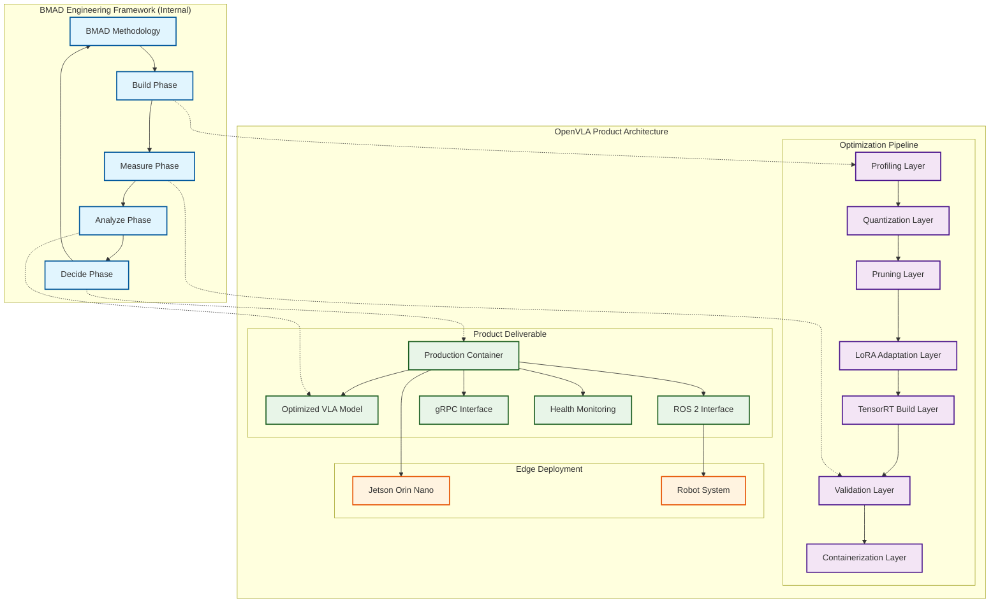
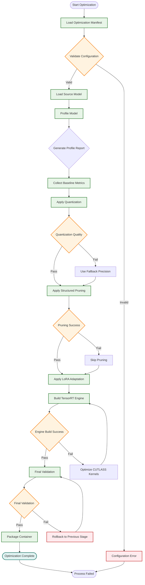
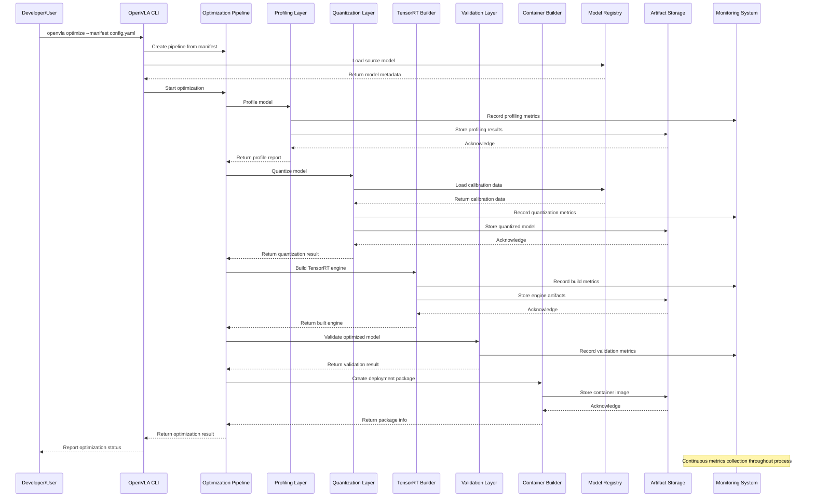
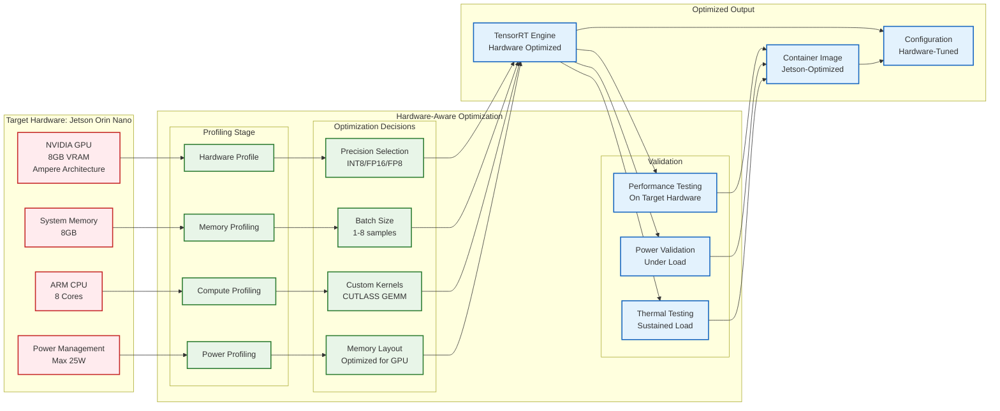
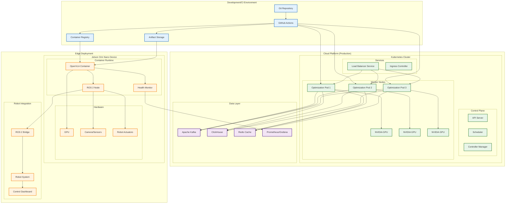
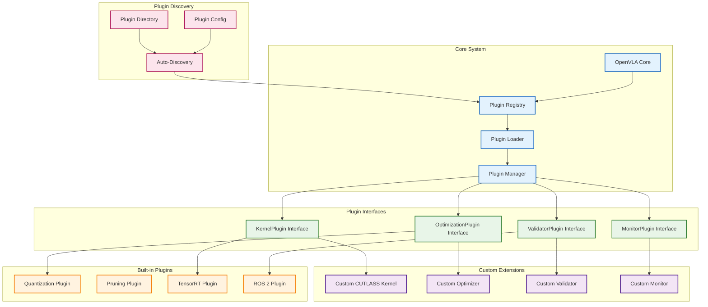
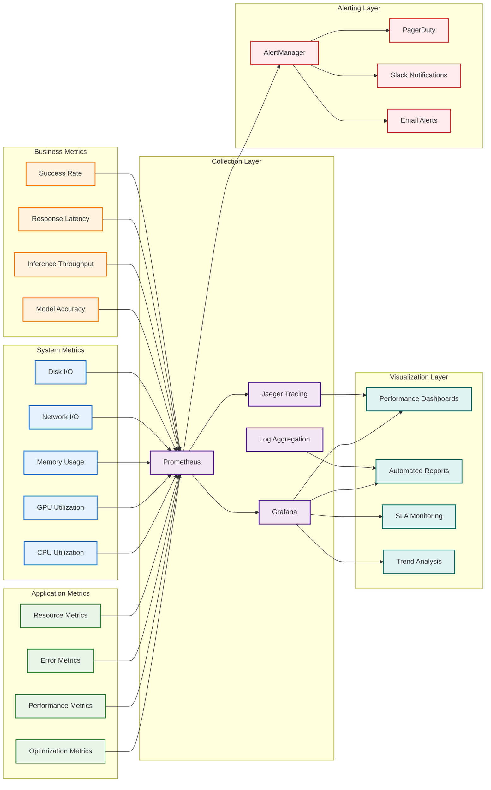

# OpenVLA Edge Optimization Framework - Architecture Diagrams

**Version:** 1.0
**Date:** 2025-10-08
**Status**: Architecture Visualizations

---

## Overview

This document contains comprehensive architecture diagrams using Mermaid syntax to visually represent the OpenVLA Edge Optimization Framework architecture, complementing the written solution architecture documents.

---

## 1. High-Level System Architecture

---

## 2. Detailed Optimization Pipeline Flow

---

## 3. Component Interaction Patterns

---

## 4. Hardware-Aware Optimization Architecture

---

## 5. Deployment and Integration Architecture

---

## 6. Data Flow and State Management

```mermaid
stateDiagram-v2
    [*] --> ModelLoaded
    ModelLoaded --> Profiling: Start Optimization
    Profiling --> ProfileComplete: Profile Generated

    ProfileComplete --> Quantization: Start Quantization
    Quantization --> QuantizationSuccess: Quantization Complete
    Quantization --> FallbackToFP16: INT8 Failed
    FallbackToFP16 --> QuantizationSuccess: FP16 Complete

    QuantizationSuccess --> Pruning: Start Pruning
    Pruning --> PruningSuccess: Pruning Complete
    Pruning --> SkipPruning: Pruning Failed
    SkipPruning --> PruningSuccess: Continue without Pruning

    PruningSuccess --> LoRAAdaptation: Apply LoRA
    LoRAAdaptation --> LoRASuccess: LoRA Applied
    LoRAAdaptation --> SkipLoRA: LoRA Failed
    SkipLoRA --> LoRASuccess: Continue without LoRA

    LoRASuccess --> TensorRTBuild: Build TensorRT Engine
    TensorRTBuild --> BuildSuccess: Engine Built
    TensorRTBuild --> OptimizeKernels: Build Failed
    OptimizeKernels --> BuildSuccess: Kernels Optimized

    BuildSuccess --> Validation: Validate Model
    Validation --> ValidationSuccess: Validation Passed
    Validation --> ValidationFailed: Validation Failed
    ValidationFailed --> Rollback: Rollback to Previous State
    Rollback --> Validation: Retry Validation

    ValidationSuccess --> Packaging: Package Container
    Packaging --> PackagingComplete: Package Ready
    PackagingComplete --> Deployment: Deploy to Edge
    Deployment --> DeploymentSuccess: Deployed Successfully
    Deployment --> DeploymentFailed: Deployment Failed
    DeploymentFailed --> Deployment: Retry Deployment

    DeploymentSuccess --> Monitoring: Monitor Performance
    Monitoring --> PerformanceOK: Performance Acceptable
    Monitoring --> PerformanceIssue: Performance Degraded
    PerformanceIssue --> Reoptimization: Trigger Reoptimization
    Reoptimization --> Profiling: Start New Optimization Cycle
    PerformanceOK --> Monitoring: Continue Monitoring

    state ModelLoaded {
        [*] --> LoadSourceModel
        LoadSourceModel --> ModelValidated
        ModelValidated --> [*]
    }

    state Profiling {
        [*] --> InitializeProfiler
        InitializeProfiler --> AnalyzeArchitecture
        AnalyzeArchitecture --> MeasureBaseline
        MeasureBaseline --> GenerateProfile
        GenerateProfile --> [*]
    }

    state Monitoring {
        [*] --> CollectMetrics
        CollectMetrics --> AnalyzePerformance
        AnalyzePerformance --> CheckThresholds
        CheckThresholds --> UpdateDashboard
        UpdateDashboard --> [*]
    }
```

---

## 7. Plugin and Extension Architecture

---

## 8. Security Architecture

```mermaid
graph TB
    subgraph "Security Layers"
        subgraph "Application Security"
            Auth[Authentication/Authorization]
            Input[Input Validation]
            Error[Error Handling]
            Logging[Security Logging]
        end

        subgraph "Container Security"
            Image[Image Scanning]
            Runtime[Runtime Protection]
            Network[Network Policies]
            Secrets[Secret Management]
        end

        subgraph "Infrastructure Security"
            IAM[IAM Policies]
            VPC[Network Isolation]
            Encryption[Encryption at Rest]
            Backup[Secure Backups]
        end

        subgraph "Data Security"
            Transit[Encryption in Transit]
            Classification[Data Classification]
            Access[Access Controls]
            Audit[Audit Logging]
        end
    end

    subgraph "Security Controls"
        subgraph "Prevention"
            WAF[Web Application Firewall]
            RBAC[Role-Based Access Control]
            MFA[Multi-Factor Authentication]
            Scanning[Vulnerability Scanning]
        end

        subgraph "Detection"
            SIEM[SIEM Integration]
            Monitoring[Security Monitoring]
            Alerts[Security Alerts]
            Forensics[Forensic Tools]
        end

        subgraph "Response"
            Incident[Incident Response]
            Isolation[Isolation Procedures]
            Recovery[Recovery Plans]
            Communication[Communication Plan]
        end
    end

    Auth --> RBAC
    Input --> WAF
    Image --> Scanning
    Runtime --> Monitoring
    IAM --> MFA
    VPC --> SIEM
    Encryption --> Backup
    Transit --> Access
    Classification --> Audit
    Network --> Alerts
    Secrets --> Forensics
    Error --> Incident
    Logging --> Isolation

    classDef layer fill:#e8f5e8,stroke:#2e7d32,stroke-width:2px
    classDef control fill:#e3f2fd,stroke:#1565c0,stroke-width:2px
    classDef prevention fill:#fff3e0,stroke:#f57c00,stroke-width:2px
    classDef detection fill:#f3e5f5,stroke:#4a148c,stroke-width:2px
    classDef response fill:#ffebee,stroke:#c62828,stroke-width:2px

    class Auth,Input,Error,Logging,Image,Runtime,Network,Secrets,IAM,VPC,Encryption,Backup,Transit,Classification,Access,Audit layer
    class WAF,RBAC,MFA,Scanning,SIEM,Monitoring,Alerts,Forensics,Incident,Isolation,Recovery,Communication control
    class WAF,RBAC,MFA,Scanning prevention
    class SIEM,Monitoring,Alerts,Forensics detection
    class Incident,Isolation,Recovery,Communication response
```

---

## 9. Performance Monitoring and Observability

---

## 10. Test Architecture and Quality Assurance

```mermaid
graph TB
    subgraph "Test Pyramid"
        subgraph "Unit Tests (70%)"
            TestUnit1[Component Tests]
            TestUnit2[Function Tests]
            TestUnit3[Method Tests]
            TestUnit4[Mock Tests]
        end

        subgraph "Integration Tests (20%)"
            TestInt1[Service Integration]
            TestInt2[Database Integration]
            TestInt3[API Integration]
            TestInt4[Pipeline Integration]
        end

        subgraph "E2E Tests (10%)"
            TestE2E1[Full Pipeline]
            TestE2E2[User Scenarios]
            TestE2E3[Performance Tests]
            TestE2E4[Security Tests]
        end
    end

    subgraph "Test Infrastructure"
        TestFramework[Pytest Framework]
        TestData[Test Data Management]
        MockServices[Mock Services]
        TestEnv[Test Environments]
    end

    subgraph "Quality Gates"
        CodeCoverage[Code Coverage > 80%]
        PerformanceSLA[Performance SLA]
        SecurityScan[Security Scanning]
        QualityGate[Quality Gate]
    end

    subgraph "CI/CD Integration"
        PRTests[PR Pipeline Tests]
        MergeTests[Merge Pipeline Tests]
        ReleaseTests[Release Pipeline Tests]
        ProdValidation[Production Validation]
    end

    TestUnit1 --> TestFramework
    TestUnit2 --> TestFramework
    TestUnit3 --> TestFramework
    TestUnit4 --> MockServices

    TestInt1 --> TestData
    TestInt2 --> TestData
    TestInt3 --> MockServices
    TestInt4 --> TestEnv

    TestE2E1 --> TestEnv
    TestE2E2 --> TestEnv
    TestE2E3 --> TestEnv
    TestE2E4 --> TestEnv

    TestFramework --> CodeCoverage
    TestData --> PerformanceSLA
    MockServices --> SecurityScan
    TestEnv --> QualityGate

    CodeCoverage --> PRTests
    PerformanceSLA --> MergeTests
    SecurityScan --> ReleaseTests
    QualityGate --> ProdValidation

    classDef unit fill:#e8f5e8,stroke:#2e7d32,stroke-width:2px
    classDef integration fill:#e3f2fd,stroke:#1565c0,stroke-width:2px
    classDef e2e fill:#fff3e0,stroke:#f57c00,stroke-width:2px
    classDef infra fill:#f3e5f5,stroke:#4a148c,stroke-width:2px
    classDef gates fill:#ffebee,stroke:#c62828,stroke-width:2px
    classDef cicd fill:#e0f2f1,stroke:#00695c,stroke-width:2px

    class TestUnit1,TestUnit2,TestUnit3,TestUnit4 unit
    class TestInt1,TestInt2,TestInt3,TestInt4 integration
    class TestE2E1,TestE2E2,TestE2E3,TestE2E4 e2e
    class TestFramework,TestData,MockServices,TestEnv infra
    class CodeCoverage,PerformanceSLA,SecurityScan,QualityGate gates
    class PRTests,MergeTests,ReleaseTests,ProdValidation cicd
```

---

## Usage Instructions

These Mermaid diagrams can be rendered in various Markdown viewers that support Mermaid, including:

1. **GitHub**: Native support in Markdown files
2. **GitLab**: Built-in Mermaid support
3. **VS Code**: With Mermaid preview extensions
4. **Obsidian**: Built-in Mermaid support
5. **Typora**: Mermaid plugin support
6. **Mark Text**: Built-in Mermaid support

### Online Mermaid Editors:

- [Mermaid Live Editor](https://mermaid.live)
- [Mermaid Diagram Editor](https://mermaid-js.github.io/mermaid-live-editor)

### Integration with Documentation:

These diagrams complement the written architecture documents by providing visual representations of:

- System architecture and component relationships
- Data flow and process flows
- Deployment and infrastructure patterns
- Security and monitoring architectures
- Testing and quality assurance structures

The diagrams follow consistent styling and color-coding to enhance readability and maintain architectural clarity across all visualizations.
