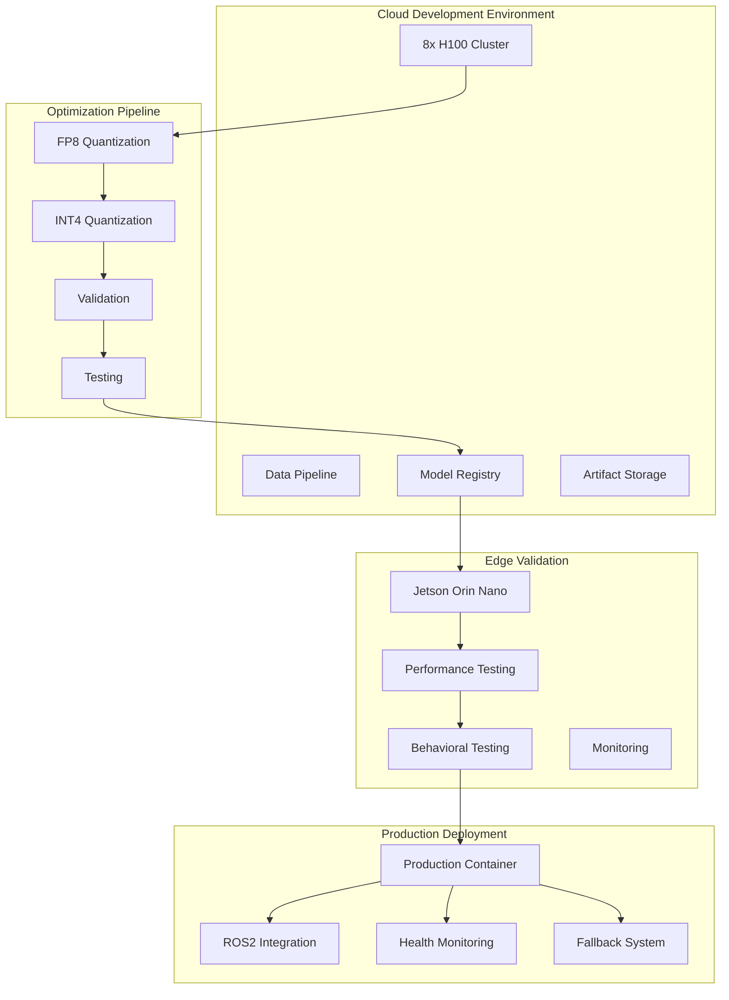

# Integration of Dusty's OpenVLA Learnings into Architecture

**Version:** 1.0
**Date:** 2025-10-08
**Status**: Incorporating Expert Experience into V1.0 Strategy

---

## Executive Summary

This document integrates the critical learnings from Dusty's early OpenVLA prototyping work on Jetson AGX Orin devices into our architecture and strategy. His experience provides invaluable insights into quantization trade-offs, performance realities, and the importance of cloud-based fine-tuning for achieving optimal results.

---

## 1. Key Learnings from Dusty's Prototyping

### Quantization Realities

```yaml
quantization_insights:
  fp8_quantization:
    performance: 'Next to no quantization loss'
    recommendation: 'Primary quantization target for V1.0'
    behavioral_impact: 'Minimal'
    success_criteria: '≥99% accuracy retention'

  int4_quantization:
    performance: '5% quantization loss'
    behavioral_impact: 'Noticeable issues in agent behavior'
    recommendation: 'Secondary target with careful validation'
    success_criteria: '≥95% accuracy retention'
    validation_requirement: 'Extensive behavioral testing'

  performance_targets:
    jetson_agx_orin_fps: '2.1 FPS (baseline)'
    jetson_orin_nano_target: '3+ FPS (V1.0 goal)'
    real_time_requirement: 'System must keep pace with simulator'
```

### Critical System-Level Insights

```yaml
system_optimization:
  repeat_previous_action:
    strategy: 'Repeat last action if inference deadline missed'
    rationale: 'Prevents agent freezing between inference steps'
    implementation: 'Fallback mechanism in inference server'
    success_metric: 'Zero agent freezing events'

  data_pipeline_consistency:
    challenge: 'Coordinate spaces, action spaces, normalization'
    solution: 'Meticulous data pipeline validation'
    importance: 'Critical for model training and inference'
    validation_requirement: 'End-to-end data consistency checks'
```

### Fine-Tuning Workflow Evolution

```yaml
dustys_learning_journey:
  phase_1_jetson_lora:
    approach: 'On-device LoRA tuning on AGX Orin'
    experiments: 'LoRA rank 32 → 128'
    limitations: 'Reached device capabilities'
    success_rate: 'Limited by hardware constraints'

  phase_2_multi_node:
    approach: 'Multi-node LoRA across AGX Orins'
    result: 'Technically successful but impractical'
    limitation: 'Not realistic for average developers'
    conclusion: 'Cloud approach needed'

  phase_3_cloud_fine_tuning:
    approach: '8x H100 cloud instance'
    duration: '~50 minutes'
    accuracy_improvement: '>5% jump'
    conclusion: 'Most effective approach'
    recommendation: 'Primary method for V1.0'
```

---

## 2. Updated Architecture Strategy

### Cloud-First Development Strategy

```yaml
cloud_first_approach:
  development_workflow:
    phase_1_cloud_optimization:
      environment: 'High-performance cloud GPUs (8x H100)'
      purpose: 'Initial optimization and fine-tuning'
      benefits:
        - 'No hardware constraints during experimentation'
        - 'Faster iteration cycles'
        - 'Better model accuracy'
        - 'Comprehensive testing capabilities'

    phase_2_jetson_validation:
      environment: 'Jetson Orin Nano target hardware'
      purpose: 'Validate cloud optimizations on target device'
      validation_criteria:
        - 'Performance targets met'
        - 'Accuracy retained'
        - 'Stable operation'
        - 'Memory constraints respected'

    phase_3_deployment_optimization:
      environment: 'Production Jetson deployment'
      purpose: 'Final optimization and deployment'
      activities:
        - 'Fine-tune for specific hardware'
        - 'Optimize for production workloads'
        - 'Validate long-term stability'

  infrastructure_requirements:
    cloud_resources:
      - '8x H100 cluster for fine-tuning'
      - 'High-speed storage for model artifacts'
      - 'Data pipeline for simulator integration'
      - 'Automated deployment pipelines'

    edge_validation:
      - 'Jetson Orin Nano test devices'
      - 'Automated testing framework'
      - 'Performance monitoring'
      - 'Thermal management validation'
```

### Updated Quantization Strategy

```yaml
revised_quantization_strategy:
  primary_target:
    precision: 'FP8'
    rationale: "Dusty's experience: next to no quantization loss"
    accuracy_target: '≥99% retention'
    performance_target: '≥3Hz on Jetson Orin Nano'
    risk_level: 'Low'

  secondary_target:
    precision: 'INT4'
    rationale: 'Aggressive optimization for edge deployment'
    accuracy_target: '≥95% retention'
    performance_target: '≥5Hz on Jetson Orin Nano'
    risk_level: 'Medium'
    validation_requirement: 'Extensive behavioral testing'

  fallback_strategy:
    sequence: 'FP8 → INT4 → INT8 → FP16 → FP32'
    triggers: 'Accuracy thresholds, performance requirements'
    automation: 'Automatic fallback based on validation'

  validation_protocol:
    accuracy_validation:
      - 'Benchmark dataset testing'
      - 'Behavioral task validation'
      - 'Edge case testing'
      - 'Long-term stability testing'

    performance_validation:
      - 'Latency measurement'
      - 'Throughput testing'
      - 'Memory usage validation'
      - 'Thermal performance'
```

---

## 3. Updated Implementation Plan

### Phase 1: Cloud-Based Optimization (Week 1-4)

```yaml
phase_1_cloud_optimization:
  week_1_2:
    infrastructure_setup:
      - 'Setup 8x H100 cloud cluster'
      - 'Configure data pipelines'
      - 'Implement automated testing'
      - 'Setup monitoring and logging'

    model_preparation:
      - 'OpenVLA-7B model preparation'
      - 'Data pipeline validation'
      - 'Calibration dataset preparation'
      - 'Testing framework setup'

  week_3_4:
    optimization_development:
      - 'FP8 quantization implementation'
      - 'Performance optimization'
      - 'Accuracy validation'
      - 'Iterative refinement'

    validation_and_testing:
      - 'Comprehensive accuracy testing'
      - 'Performance benchmarking'
      - 'Behavioral validation'
      - 'Success criteria validation'

  deliverables:
    - 'FP8-optimized OpenVLA model'
    - 'Performance benchmarking report'
    - 'Accuracy validation results'
    - 'Cloud deployment pipeline'
```

### Phase 2: Jetson Validation (Week 5-6)

```yaml
phase_2_jetson_validation:
  week_5:
    hardware_setup:
      - 'Jetson Orin Nano test environment'
      - 'Monitoring and debugging tools'
      - 'Automated deployment pipeline'
      - 'Performance validation framework'

    deployment_validation:
      - 'Deploy FP8 model to Jetson'
      - 'Performance validation on target hardware'
      - 'Memory usage validation'
      - 'Thermal performance testing'

  week_6:
    optimization_and_testing:
      - 'Jetson-specific optimizations'
      - 'Performance tuning'
      - 'Stability testing'
      - 'Final validation'

  deliverables:
    - 'Jetson-optimized FP8 model'
    - 'Performance validation report'
    - 'Deployment package'
    - 'V1.0 release candidate'
```

---

## 4. Updated Success Criteria

### Revised Performance Targets

```yaml
updated_success_criteria:
  primary_fp8_optimization:
    accuracy_retention: '≥99%'
    latency_p95_ms: '< 200ms'
    throughput_hz: '> 5Hz'
    memory_usage: '< 4GB'
    stability: '72-hour continuous operation'

  secondary_int4_optimization:
    accuracy_retention: '≥95%'
    latency_p95_ms: '< 150ms'
    throughput_hz: '> 6Hz'
    memory_usage: '< 3GB'
    stability: '72-hour continuous operation'

  behavioral_validation:
    task_success_rate: '≥95%'
    agent_freezing_events: '0'
    action_consistency: '100%'
    behavioral_accuracy: '≥98%'

  system_performance:
    repeat_action_rate: '< 1%'
    inference_deadline_miss: '< 1%'
    system_response_time: '< 10ms'
    overall_success_rate: '≥99%'
```

### Risk Mitigation Updates

```yaml
revised_risk_assessment:
  reduced_risks:
    quantization_accuracy:
      original_risk: 'High (unknown accuracy impact)'
      revised_risk: "Low (Dusty's FP8 experience)"
      mitigation: 'FP8 primary target with proven success'

    performance_targets:
      original_risk: 'High (unrealistic expectations)'
      revised_risk: 'Medium (based on real data)'
      mitigation: "Dusty's 2.1 FPS on AGX Orin baseline"

  remaining_risks:
    int4_behavioral_impact:
      risk_level: 'Medium'
      mitigation: 'Extensive behavioral testing'
      validation: "Dusty's 5% loss experience"

    jetson_nano_constraints:
      risk_level: 'Medium'
      mitigation: 'Cloud-first approach, hardware validation'
      validation: 'Performance testing on target device'

    cloud_edge_gap:
      risk_level: 'Low'
      mitigation: 'Phased validation approach'
      validation: 'Systematic testing on target hardware'
```

---

## 5. Updated Technical Architecture

### Cloud-First Pipeline Architecture



### Data Pipeline Architecture

```yaml
data_pipeline_architecture:
  cloud_optimization:
    simulator_integration:
      - 'Direct simulator integration planned'
      - 'Unlimited on-the-fly training data'
      - 'Eliminates export/convert/transfer steps'
      - 'Real-time data generation'

    data_consistency:
      - 'Coordinate space validation'
      - 'Action space normalization'
      - 'Preprocessing consistency'
      - 'End-to-end validation'

  edge_deployment:
    inference_pipeline:
      - 'Consistent preprocessing'
      - 'Coordinate space transformations'
      - 'Action space mapping'
      - 'Normalization application'

    monitoring:
      - 'Data pipeline validation'
      - 'Consistency checks'
      - 'Performance monitoring'
      - 'Error detection'
```

---

## 6. Updated Development Workflow

### Cloud-First Development Process

```yaml
development_workflow:
  stage_1_cloud_optimization:
    environment: '8x H100 cloud cluster'
    activities:
      - 'Model preparation and validation'
      - 'FP8 quantization implementation'
      - 'Performance optimization'
      - 'Accuracy validation'
    success_criteria:
      - 'FP8 model with ≥99% accuracy'
      - 'Performance benchmarks established'
      - 'Validation pipeline working'

  stage_2_jetson_validation:
    environment: 'Jetson Orin Nano'
    activities:
      - 'Deploy cloud-optimized model'
      - 'Performance validation on hardware'
      - 'Memory usage validation'
      - 'Behavioral testing'
    success_criteria:
      - 'Performance targets met on hardware'
      - 'Memory constraints respected'
      - 'Behavioral accuracy maintained'

  stage_3_production_optimization:
    environment: 'Production deployment'
    activities:
      - 'Fine-tune for specific hardware'
      - 'Production deployment'
      - 'Monitoring setup'
      - 'Long-term validation'
    success_criteria:
      - 'Stable production operation'
      - 'All success criteria met'
      - 'Ready for customer deployment'
```

### Iterative Development Process

```yaml
iteration_strategy:
  rapid_prototyping:
    cycle_time: '1 week iterations'
    feedback_loops:
      - 'Performance metrics'
      - 'Accuracy validation'
      - 'Behavioral testing'
      - 'User feedback'

  validation_gates:
    gate_1: 'Cloud optimization success'
    gate_2: 'Jetson validation success'
    gate_3: 'Production readiness'

  success_metrics:
    - 'Weekly progress toward targets'
    - 'Iterative improvement'
    - 'Risk reduction'
    - 'Stakeholder alignment'
```

---

## 7. Updated Resource Requirements

### Cloud Infrastructure

````yaml
cloud_resources:
  compute:
    h100_cluster: "8x H100 GPUs"
    storage: "High-speed SSD storage"
    network: "High-bandwidth interconnect"
    duration: "4 weeks intensive, then on-demand"

  software:
    - "PyTorch 2.0+ with FP8 support"
    - "TensorRT with FP8 kernels"
    - "CUDA 12.1+"
    - "Development and debugging tools"

  personnel:
    - "ML optimization specialist"
    - "Cloud infrastructure engineer"
    - "Data pipeline engineer"
    - "Validation engineer"

### Edge Validation
```yaml
edge_resources:
  hardware:
    jetson_orin_nano: "2-3 devices for testing"
    peripherals: "Cameras, sensors, robot hardware"
    monitoring: "Thermal and performance monitoring"

  software:
    - "JetPack 6.2.1"
    - "Docker with NVIDIA runtime"
    - "ROS 2 Humble"
    - "Development and debugging tools"

  personnel:
    - "Embedded systems engineer"
    - "Robotics specialist"
    - "Validation engineer"
````

---

## 8. Conclusion and Next Steps

### Key Insights from Dusty's Experience

1. **FP8 is the sweet spot**: Near-zero quantization loss with good performance
2. **INT4 requires careful validation**: 5% loss can cause behavioral issues
3. **Cloud-first approach is essential**: Hardware constraints limit on-device development
4. **Fine-tuning makes the difference**: >5% accuracy improvement from cloud fine-tuning
5. **Data consistency is critical**: Coordinate spaces and normalization must be perfect

### Updated V1.0 Strategy

1. **Cloud-first development**: Start with cloud optimization, validate on edge
2. **FP8 primary target**: Based on Dusty's successful experience
3. **Extensive validation**: Both performance and behavioral validation required
4. **Iterative approach**: Rapid prototyping with continuous validation
5. **Production focus**: Ensure stable, reliable operation

### Immediate Actions

1. **Setup cloud infrastructure**: 8x H100 cluster for optimization
2. **Implement FP8 quantization**: Primary optimization target
3. **Develop validation framework**: Both performance and behavioral testing
4. **Plan edge validation**: Jetson Orin Nano testing framework
5. **Update success criteria**: Based on real-world experience and data

This integration of Dusty's learnings significantly de-risks our V1.0 strategy by providing real-world experience with OpenVLA optimization on Jetson hardware, while establishing a cloud-first approach that maximizes our chances of success.
